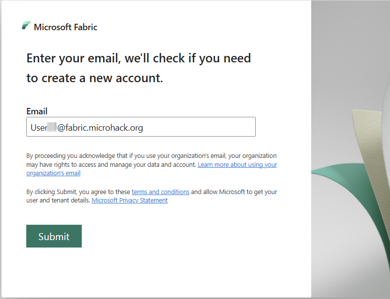
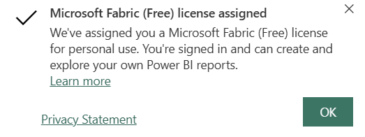
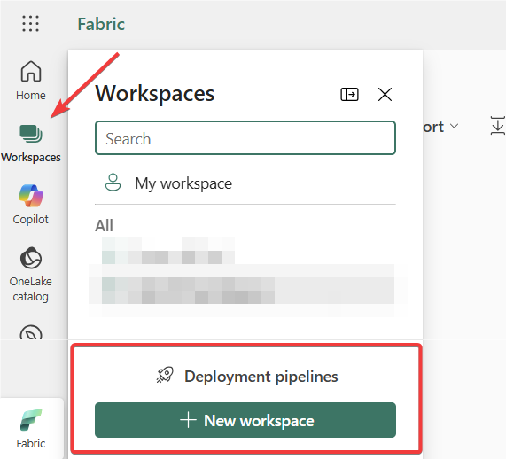
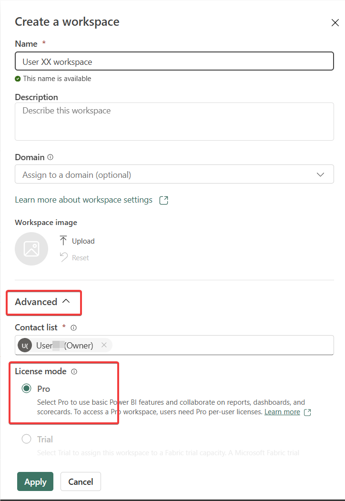
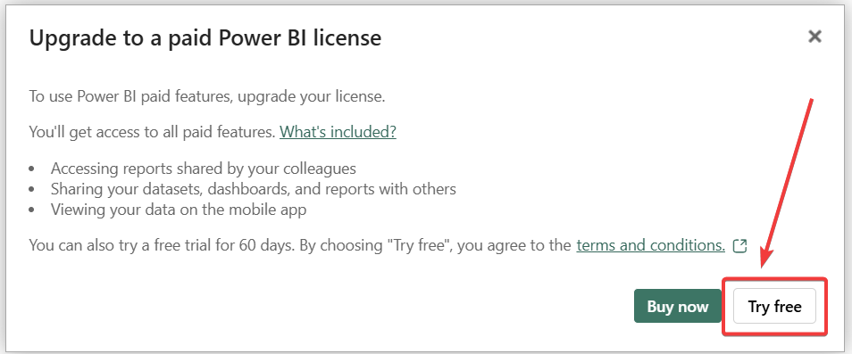
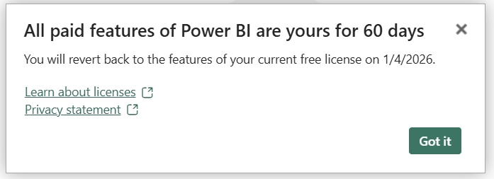

# Pre-req.: New Azure User Setup

> [!NOTE]
> 
> Back to [Readme](/README.md)

### Activate the Power BI Pro Trial account

1) Go to the Fabric native website - https://app.fabric.microsoft.com/ (similar approach is feasible also on an alternative URL - https://app.powerbi.com/).

2) Sign-up with your newly onboarded user (you may be prompted to sign-in or since you signed-in within the previous steps, the process could continue immediately without requiring password and MFA)

In the upper right corner, you can see the *Power BI Free* license was automatically assigned to this user, however for the purpose of this MicroHack we would need to thave Power BI Pro Trial assigned on top of that.

3) To initiate the offer for the Power BI Pro Trial, we need to create some activity requiring such a license - so we will choose the simplest one of them. *Create a Workspace*. Click on the Workspaces in the left pane and click the button at the bottom of the page:

4) Once the popup pane shows up, give your new workspace a name and in the *Advanced* section make sure the "backed up" by the **Pro** license.

5) Since the Pro license is needed for this step, you will be prompted, whether you want to Buy or try the new license. Click on the *Try Free* option within the dialog.

6) You have now activated the **Power BI Trial** license for your account and the dialog popup should confirm that.

## Success Criteria

- Azure portal user able to login
- Microsoft Fabric user logged in and Power BI Trial license active

## Next challenge is:
>[Challenge 01](/challenges/ch01/README.md)
